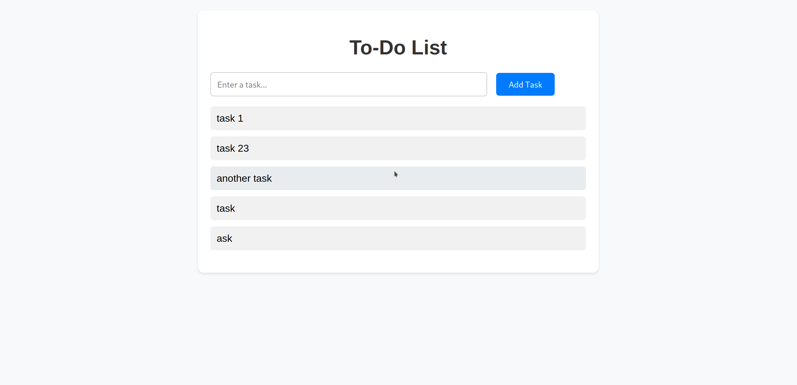

# To-Do List App

This is a simple to-do list app built using HTML, CSS, and JavaScript. The app allows users to add, edit, delete tasks, and manage multiple lists.

## Features

- Add tasks to the to-do list
- Edit tasks inline
- Local storage - stores data even after page refresh

## To Be Implemented
- Delete tasks
- Sort tasks alphabetically
- Filter completed tasks
- Multiple lists with tabs

## Getting Started

1. Clone the repository
2. Open `index.html` in your web browser
3. Start managing your tasks!

## Screenshots

## License

This project is licensed under the MIT License - see the [LICENSE](LICENSE) file for details.
